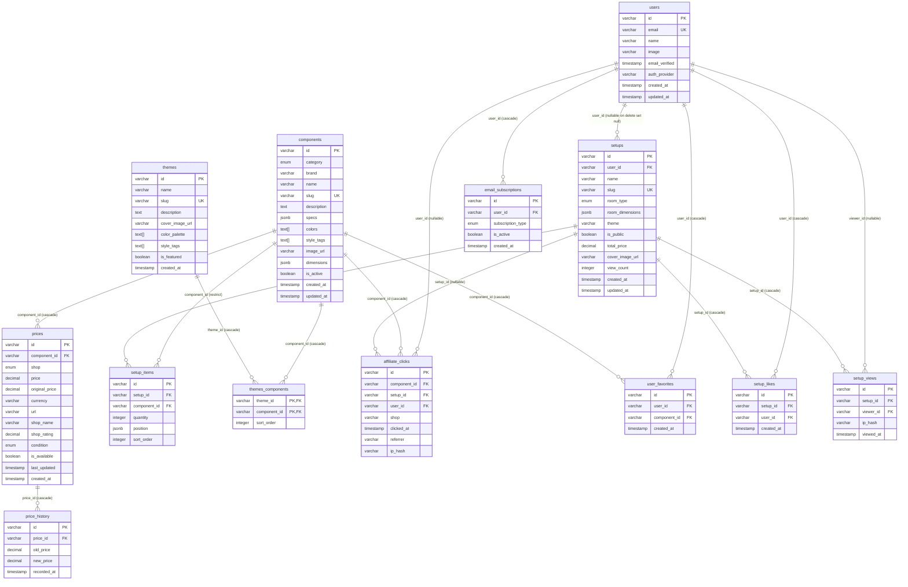

# gobuildgo — Database Design Document

**Version:** 1.0
**Date:** 2026-06-18
**Database:** PostgreSQL (Neon serverless)
**ORM:** Prisma
**Currency:** VND (Vietnamese Dong)

---

## 1. Entity Relationship Diagram



---

## 2. Complete Table Definitions

### 2.1 Enum Types

```sql
-- Component categories matching the 9 setup slots
CREATE TYPE component_category AS ENUM (
  'desk', 'chair', 'monitor', 'keyboard', 'mouse',
  'lighting', 'decor', 'audio', 'accessory'
);

-- Vietnamese e-commerce shops
CREATE TYPE shop_enum AS ENUM (
  'shopee', 'lazada', 'tiki', 'phongvu', 'gearvn', 'nhaxinh'
);

-- Room types for setup context
CREATE TYPE room_type_enum AS ENUM (
  'bedroom', 'gaming_room', 'office', 'studio'
);

-- Item condition
CREATE TYPE condition_enum AS ENUM (
  'new', 'used'
);

-- Email subscription types
CREATE TYPE subscription_type_enum AS ENUM (
  'price_alert', 'weekly_digest', 'promotions'
);
```

---

### 2.2 `users`

Stores authenticated user accounts via NextAuth (Google + Facebook).

| Column | Type | Constraints | Description |
|---|---|---|---|
| `id` | `VARCHAR` | `PRIMARY KEY` | CUID v2 identifier |
| `email` | `VARCHAR(255)` | `UNIQUE` | User email address |
| `name` | `VARCHAR(255)` | `NULL` | Display name |
| `image` `VARCHAR(500)` | `NULL` | Avatar URL |
| `email_verified` | `TIMESTAMPTZ` | `NULL` | When email was verified |
| `auth_provider` | `VARCHAR(50)` | `NOT NULL` | `google` or `facebook` |
| `created_at` | `TIMESTAMPTZ` | `NOT NULL DEFAULT now()` | Account creation time |
| `updated_at` | `TIMESTAMPTZ` | `NOT NULL DEFAULT now()` | Last profile update |

**Notes:**
- `email` is nullable because some OAuth providers may not return it.
- On user deletion, email/name are anonymized (see Section 6).
- Setups owned by deleted users become orphaned (`user_id` set to NULL).

---

### 2.3 `components`

Core catalog of all desk setup items across 9 categories.

| Column | Type | Constraints | Description |
|---|---|---|---|
| `id` | `VARCHAR` | `PRIMARY KEY` | CUID v2 identifier |
| `category` | `component_category` | `NOT NULL` | One of 9 setup categories |
| `brand` | `VARCHAR(255)` | `NOT NULL` | Brand name (e.g., "IKEA", "Logitech") |
| `name` | `VARCHAR(500)` | `NOT NULL` | Product display name |
| `slug` | `VARCHAR(600)` | `UNIQUE NOT NULL` | URL-friendly identifier |
| `description` | `TEXT` | `NULL` | Long-form product description |
| `specs` | `JSONB` | `NOT NULL DEFAULT '{}'` | Flexible specs per category (see below) |
| `colors` | `TEXT[]` | `NOT NULL DEFAULT '{}'` | Available colors |
| `style_tags` | `TEXT[]` | `NOT NULL DEFAULT '{}'` | Style labels: `minimalist`, `gaming`, `japandi`, etc. |
| `image_url` | `VARCHAR(500)` | `NULL` | Primary product image URL (Cloudflare R2) |
| `dimensions` | `JSONB` | `NULL` | Physical size: `{width, depth, height, weight}` in cm/g |
| `is_active` | `BOOLEAN` | `NOT NULL DEFAULT true` | Soft-delete / hide flag |
| `created_at` | `TIMESTAMPTZ` | `NOT NULL DEFAULT now()` | Record creation |
| `updated_at` | `TIMESTAMPTZ` | `NOT NULL DEFAULT now()` | Last update |

**`specs` JSONB shape per category:**

```json
// Desk
{"width": 140, "depth": 70, "height": 75, "material": "bamboo", "shape": "rectangular", "adjustable_height": true}

// Chair
{"max_weight_kg": 120, "material": "mesh", "armrest": "adjustable", "recline": true}

// Monitor
{"size_inch": 27, "resolution": "2560x1440", "refresh_rate": 165, "panel": "IPS", "curved": false}

// Keyboard
{"switch_type": "red", "layout": "75%", "connection": "wireless", "backlight": "RGB"}

// Mouse
{"dpi": 25500, "connection": "wireless", "buttons": 6, "weight_g": 58}

// Lighting
{"type": "LED strip", "length_m": 2, "color_temp": "adjustable", "smart": true}

// Decor
{"type": "cable_management", "material": "metal"}

// Audio
{"type": "headset", "surround": "7.1", "connection": "USB", "noise_cancelling": true}

// Accessory
{"type": "monitor_arm", "max_weight_kg": 9, "vesa": "100x100"}
```

**`dimensions` JSONB shape:**

```json
{"width": 140, "depth": 70, "height": 75, "weight": 25000}
// All in cm and grams; null fields if not applicable
```

---

### 2.4 `prices`

One or more prices per component from different shops. Stores affiliate links.

| Column | Type | Constraints | Description |
|---|---|---|---|
| `id` | `VARCHAR` | `PRIMARY KEY` | CUID v2 identifier |
| `component_id` | `VARCHAR` | `NOT NULL FK → components.id ON DELETE CASCADE` | The component this price is for |
| `shop` | `shop_enum` | `NOT NULL` | Which shop this price is from |
| `price` | `DECIMAL(12,0)` | `NOT NULL CHECK (price >= 0)` | Current price in VND |
| `original_price` | `DECIMAL(12,0)` | `NULL` | Original/list price before discount |
| `currency` | `VARCHAR(3)` | `NOT NULL DEFAULT 'VND'` | ISO 4217 currency code |
| `url` | `VARCHAR(2000)` | `NOT NULL` | Affiliate link to product page |
| `shop_name` | `VARCHAR(255)` | `NULL` | Specific seller/store name on the platform |
| `shop_rating` | `DECIMAL(2,1)` | `NULL CHECK (shop_rating >= 0 AND shop_rating <= 5)` | Seller rating (0-5) |
| `condition` | `condition_enum` | `NOT NULL DEFAULT 'new'` | New or used |
| `is_available` | `BOOLEAN` | `NOT NULL DEFAULT true` | Whether item is in stock |
| `last_updated` | `TIMESTAMPTZ` | `NOT NULL DEFAULT now()` | When price was last scraped/verified |
| `created_at` | `TIMESTAMPTZ` | `NOT NULL DEFAULT now()` | When price record was first created |

**Notes:**
- A component can have multiple prices (one per shop).
- `price` uses `DECIMAL(12,0)` to support values up to 9,999,999,999 VND (sufficient for any setup item).
- `url` stores the full affiliate link (Shopee/Lazada/Tiki affiliate tag included).

---

### 2.5 `price_history`

Tracks price changes over time for charting and alerts.

| Column | Type | Constraints | Description |
|---|---|---|---|
| `id` | `VARCHAR` | `PRIMARY KEY` | CUID v2 identifier |
| `price_id` | `VARCHAR` | `NOT NULL FK → prices.id ON DELETE CASCADE` | The price record that changed |
| `old_price` | `DECIMAL(12,0)` | `NOT NULL` | Price before change |
| `new_price` | `DECIMAL(12,0)` | `NOT NULL` | Price after change |
| `recorded_at` | `TIMESTAMPTZ` | `NOT NULL DEFAULT now()` | When the change was recorded |

**Notes:**
- Populated by trigger or application logic whenever `prices.price` is updated.
- Used for price history charts (Phase 2) and price drop alerts (Phase 3).
- Retained for 1 year (see Section 6).

---

### 2.6 `setups`

A user's desk setup configuration. Can be public (shared) or private (draft).

| Column | Type | Constraints | Description |
|---|---|---|---|
| `id` | `VARCHAR` | `PRIMARY KEY` | CUID v2 identifier |
| `user_id` | `VARCHAR` | `NULL FK → users.id ON DELETE SET NULL` | Owner; NULL if user deleted |
| `name` | `VARCHAR(255)` | `NOT NULL` | Setup name (e.g., "My Gaming Setup") |
| `slug` | `VARCHAR(300)` | `UNIQUE NOT NULL` | URL-friendly identifier |
| `room_type` | `room_type_enum` | `NULL` | Type of room |
| `room_dimensions` | `JSONB` | `NULL` | `{width, depth}` in cm |
| `theme` | `VARCHAR(100)` | `NULL` | Theme name (e.g., "Japandi", "Gaming RGB") |
| `is_public` | `BOOLEAN` | `NOT NULL DEFAULT false` | Whether visible in public gallery |
| `total_price` | `DECIMAL(12,0)` | `NULL` | Cached sum of all item prices in VND |
| `cover_image_url` | `VARCHAR(500)` | `NULL` | Generated cover image (html2canvas export) |
| `view_count` | `INTEGER` | `NOT NULL DEFAULT 0` | Denormalized view counter |
| `created_at` | `TIMESTAMPTZ` | `NOT NULL DEFAULT now()` | Creation time |
| `updated_at` | `TIMESTAMPTZ` | `NOT NULL DEFAULT now()` | Last modification time |

**`room_dimensions` JSONB shape:**

```json
{"width": 350, "depth": 400}
// Room width and depth in centimeters
```

**Notes:**
- `total_price` is denormalized and recalculated on item add/remove.
- `user_id` is nullable: setups survive user deletion (become orphaned/community setups).
- `slug` must be globally unique for public URL routing (`/setup/:slug`).

---

### 2.7 `setup_items`

Junction table linking components to setups with placement metadata.

| Column | Type | Constraints | Description |
|---|---|---|---|
| `id` | `VARCHAR` | `PRIMARY KEY` | CUID v2 identifier |
| `setup_id` | `VARCHAR` | `NOT NULL FK → setups.id ON DELETE CASCADE` | Parent setup |
| `component_id` | `VARCHAR` | `NOT NULL FK → components.id ON DELETE RESTRICT` | Component reference |
| `quantity` | `INTEGER` | `NOT NULL DEFAULT 1 CHECK (quantity > 0)` | Number of this item |
| `position` | `JSONB` | `NULL` | `{x, y}` coordinates for 2D visualizer |
| `sort_order` | `INTEGER` | `NOT NULL DEFAULT 0` | Display ordering within setup |

**`position` JSONB shape:**

```json
{"x": 120, "y": 80}
// Position in cm relative to room origin (top-left)
```

**Notes:**
- `ON DELETE RESTRICT` on `component_id` prevents deleting components that are in use.
- `sort_order` allows users to control item ordering in the UI.

---

### 2.8 `themes`

Curated theme definitions (Japandi, Industrial, Gaming RGB, etc.).

| Column | Type | Constraints | Description |
|---|---|---|---|
| `id` | `VARCHAR` | `PRIMARY KEY` | CUID v2 identifier |
| `name` | `VARCHAR(255)` | `NOT NULL` | Display name (e.g., "Japandi Minimalist") |
| `slug` | `VARCHAR(300)` | `UNIQUE NOT NULL` | URL-friendly identifier |
| `description` | `TEXT` | `NULL` | Long-form theme description |
| `cover_image_url` | `VARCHAR(500)` | `NULL` | Theme cover/hero image |
| `color_palette` | `TEXT[]` | `NOT NULL DEFAULT '{}'` | Hex color codes: `["#1a1a1a", "#f5f0e8", "#8b7355"]` |
| `style_tags` | `TEXT[]` | `NOT NULL DEFAULT '{}'` | Tags: `minimalist`, `warm`, `natural`, etc. |
| `is_featured` | `BOOLEAN` | `NOT NULL DEFAULT false` | Show on homepage / gallery highlight |
| `created_at` | `TIMESTAMPTZ` | `NOT NULL DEFAULT now()` | Creation time |

---

### 2.9 `themes_components`

Junction table for theme-to-component recommendations (many-to-many).

| Column | Type | Constraints | Description |
|---|---|---|---|
| `theme_id` | `VARCHAR` | `NOT NULL FK → themes.id ON DELETE CASCADE` | Part of composite PK |
| `component_id` | `VARCHAR` | `NOT NULL FK → components.id ON DELETE CASCADE` | Part of composite PK |
| `sort_order` | `INTEGER` | `NOT NULL DEFAULT 0` | Display order within theme |

**Primary Key:** (`theme_id`, `component_id`)

**Notes:**
- Composite primary key prevents duplicate theme-component associations.
- `sort_order` allows curating the display order of recommended items.

---

### 2.10 `affiliate_clicks`

Tracks every affiliate link click for revenue attribution and analytics.

| Column | Type | Constraints | Description |
|---|---|---|---|
| `id` | `VARCHAR` | `PRIMARY KEY` | CUID v2 identifier |
| `component_id` | `VARCHAR` | `NOT NULL FK → components.id ON DELETE CASCADE` | Which component was clicked |
| `setup_id` | `VARCHAR` | `NULL FK → setups.id ON DELETE SET NULL` | Setup context (if clicked from a setup) |
| `user_id` | `VARCHAR` | `NULL FK → users.id ON DELETE SET NULL` | Logged-in user (if any) |
| `shop` | `VARCHAR(50)` | `NOT NULL` | Shop identifier at time of click |
| `clicked_at` | `TIMESTAMPTZ` | `NOT NULL DEFAULT now()` | Click timestamp |
| `referrer` | `VARCHAR(500)` | `NULL` | Page URL where click originated |
| `ip_hash` | `VARCHAR(64)` | `NULL` | SHA-256 hash of IP (for dedup, not PII) |

**Notes:**
- Inserted asynchronously (fire-and-forget) to avoid blocking the redirect.
- `ip_hash` enables click deduplication without storing raw IPs (GDPR/privacy).
- Retained for 1 year for attribution window analysis.

---

### 2.11 `user_favorites`

Components favorited/saved by users for later reference.

| Column | Type | Constraints | Description |
|---|---|---|---|
| `id` | `VARCHAR` | `PRIMARY KEY` | CUID v2 identifier |
| `user_id` | `VARCHAR` | `NOT NULL FK → users.id ON DELETE CASCADE` | Who favorited |
| `component_id` | `VARCHAR` | `NOT NULL FK → components.id ON DELETE CASCADE` | Which component |
| `created_at` | `TIMESTAMPTZ` | `NOT NULL DEFAULT now()` | When favorited |

**Unique Constraint:** (`user_id`, `component_id`) — one favorite per user per component.

---

### 2.12 `setup_likes`

Likes on public setups (social engagement metric).

| Column | Type | Constraints | Description |
|---|---|---|---|
| `id` | `VARCHAR` | `PRIMARY KEY` | CUID v2 identifier |
| `setup_id` | `VARCHAR` | `NOT NULL FK → setups.id ON DELETE CASCADE` | Liked setup |
| `user_id` | `VARCHAR` | `NOT NULL FK → users.id ON DELETE CASCADE` | Who liked |
| `created_at` | `TIMESTAMPTZ` | `NOT NULL DEFAULT now()` | When liked |

**Unique Constraint:** (`setup_id`, `user_id`) — one like per user per setup.

---

### 2.13 `setup_views`

Tracks every view of a setup page for analytics.

| Column | Type | Constraints | Description |
|---|---|---|---|
| `id` | `VARCHAR` | `PRIMARY KEY` | CUID v2 identifier |
| `setup_id` | `VARCHAR` | `NOT NULL FK → setups.id ON DELETE CASCADE` | Viewed setup |
| `viewer_id` | `VARCHAR` | `NULL FK → users.id ON DELETE SET NULL` | Logged-in viewer (if any) |
| `ip_hash` | `VARCHAR(64)` | `NOT NULL` | SHA-256 hash of viewer IP |
| `viewed_at` | `TIMESTAMPTZ` | `NOT NULL DEFAULT now()` | View timestamp |

**Notes:**
- `ip_hash` enables unique view counting without storing PII.
- `setups.view_count` is a denormalized counter updated asynchronously.
- Raw rows retained for 6 months, then aggregated to daily counts (see Section 6).

---

### 2.14 `email_subscriptions`

User preferences for email notifications.

| Column | Type | Constraints | Description |
|---|---|---|---|
| `id` | `VARCHAR` | `PRIMARY KEY` | CUID v2 identifier |
| `user_id` | `VARCHAR` | `NOT NULL FK → users.id ON DELETE CASCADE` | Subscriber |
| `subscription_type` | `subscription_type_enum` | `NOT NULL` | Type of email subscription |
| `is_active` | `BOOLEAN` | `NOT NULL DEFAULT true` | Whether subscription is active |
| `created_at` | `TIMESTAMPTZ` | `NOT NULL DEFAULT now()` | Subscription creation time |

**Unique Constraint:** (`user_id`, `subscription_type`) — one subscription record per type per user.

**Notes:**
- `price_alert`: notify when a favorited component drops in price.
- `weekly_digest`: trending setups and new themes.
- `promotions`: partner deals and sponsored content.

---

## 3. Indexing Strategy

### 3.1 Primary Keys

All tables use `VARCHAR` CUID v2 as primary key. PostgreSQL automatically creates a B-tree index on PK columns.

| Table | PK Column | Type |
|---|---|---|
| All tables | `id` | `VARCHAR` |
| `themes_components` | (`theme_id`, `component_id`) | Composite |

---

### 3.2 Foreign Key Indexes

Every foreign key column is indexed to optimize JOIN operations and cascade deletes.

| Table | FK Column | References | Justification |
|---|---|---|---|
| `prices` | `component_id` | `components.id` | Lookup all prices for a component |
| `price_history` | `price_id` | `prices.id` | Fetch history for a price record |
| `setups` | `user_id` | `users.id` | List all setups by a user |
| `setup_items` | `setup_id` | `setups.id` | Load all items in a setup |
| `setup_items` | `component_id` | `components.id` | Find setups containing a component |
| `themes_components` | `theme_id` | `themes.id` | List components in a theme |
| `themes_components` | `component_id` | `components.id` | Find themes for a component |
| `affiliate_clicks` | `component_id` | `components.id` | Click analytics per component |
| `affiliate_clicks` | `setup_id` | `setups.id` | Click analytics per setup |
| `affiliate_clicks` | `user_id` | `users.id` | Click history per user |
| `user_favorites` | `user_id` | `users.id` | List user's favorites |
| `user_favorites` | `component_id` | `components.id` | Count favorites per component |
| `setup_likes` | `setup_id` | `setups.id` | Count likes per setup |
| `setup_likes` | `user_id` | `users.id` | List setups a user liked |
| `setup_views` | `setup_id` | `setups.id` | View analytics per setup |
| `setup_views` | `viewer_id` | `users.id` | View history per user |
| `email_subscriptions` | `user_id` | `users.id` | List user's subscriptions |

---

### 3.3 Unique Indexes

| Table | Columns | Justification |
|---|---|---|
| `users` | `email` | Fast login lookup; enforce uniqueness |
| `components` | `slug` | URL routing (`/components/:slug`) |
| `setups` | `slug` | URL routing (`/setup/:slug`) |
| `themes` | `slug` | URL routing (`/themes/:slug`) |
| `user_favorites` | (`user_id`, `component_id`) | Prevent duplicate favorites |
| `setup_likes` | (`setup_id`, `user_id`) | Prevent duplicate likes |
| `email_subscriptions` | (`user_id`, `subscription_type`) | One subscription per type per user |

---

### 3.4 Composite Indexes for Frequent Queries

| Table | Index | Query Pattern |
|---|---|---|
| `prices` | (`component_id`, `price` ASC) | "Find lowest price for a component" |
| `prices` | (`shop`, `is_available`) | "List all available items from Shopee" |
| `components` | (`category`, `is_active`) | "List active components in category" |
| `components` | (`brand`) | "Filter by brand" |
| `setups` | (`is_public`, `created_at` DESC) | "Public gallery, newest first" |
| `setups` | (`user_id`, `created_at` DESC) | "User's setups, newest first" |
| `setups` | (`is_public`, `view_count` DESC) | "Popular setups leaderboard" |
| `setups` | (`theme`, `is_public`) | "Setups by theme" |
| `affiliate_clicks` | (`component_id`, `clicked_at` DESC) | "Recent clicks on a component" |
| `affiliate_clicks` | (`shop`, `clicked_at` DESC) | "Clicks by shop for revenue report" |
| `price_history` | (`price_id`, `recorded_at` DESC) | "Price chart data for a component" |
| `setup_views` | (`setup_id`, `viewed_at` DESC) | "Recent views of a setup" |

---

### 3.5 GIN Indexes for JSONB Columns

| Table | Column | Justification |
|---|---|---|
| `components` | `specs` | Query by arbitrary spec keys (e.g., `specs->>'material' = 'bamboo'`) |
| `components` | `dimensions` | Filter by size ranges (e.g., `dimensions->>'width' > 120`) |
| `components` | `style_tags` | Array containment queries (`style_tags @> ARRAY['minimalist']`) |
| `components` | `colors` | Filter by available colors |
| `setups` | `room_dimensions` | Filter setups by room size |
| `setup_items` | `position` | Spatial queries for visualizer |
| `themes` | `style_tags` | Match themes by style |
| `themes` | `color_palette` | Filter by color |

---

### 3.6 Partial Indexes

| Table | Index | Condition | Justification |
|---|---|---|---|
| `setups` | (`created_at` DESC) | `WHERE is_public = true` | Public gallery queries only hit public rows |
| `prices` | (`component_id`, `price` ASC) | `WHERE is_available = true` | Price comparisons only consider available items |
| `components` | (`category`, `brand`) | `WHERE is_active = true` | Catalog browsing only shows active items |
| `affiliate_clicks` | (`clicked_at` DESC) | `WHERE setup_id IS NOT NULL` | Setup-attributed click analytics |
| `email_subscriptions` | (`user_id`) | `WHERE is_active = true` | Only query active subscriptions |

---

## 4. Data Flow Descriptions

### 4.1 Price Scraping Pipeline

```
GitHub Actions (cron: every 6h)
  │
  ├── Fetch Shopee API / scrape product pages
  ├── Fetch Lazada API (via Involve Asia)
  ├── Fetch Tiki API
  │
  ▼
Normalize → {component_id, shop, price, original_price, url, shop_name, is_available}
  │
  ▼
Upsert into prices table
  │
  ├── If price changed:
  │   ├── UPDATE prices SET price = $new, last_updated = now()
  │   └── INSERT INTO price_history (price_id, old_price, new_price, recorded_at)
  │
  └── If new price record:
      └── INSERT INTO prices (...)
```

**Implementation details:**
- Scraper runs as a standalone Node.js script (`scripts/scrapers/*.ts`) invoked via `npx tsx`.
- Normalization maps shop-specific field names to our schema.
- Upsert uses `prisma.upsert()` with composite unique on (`component_id`, `shop`, `condition`).
- Price history logging is triggered by comparing old vs. new price before update.
- Failed scrapes are logged but do not block other shops.

---

### 4.2 Setup Save/Load

```
Client (Zustand state)
  │
  ▼
POST /api/setups
Body: { name, slug, roomType, roomDimensions, theme, isPublic, items: [...] }
  │
  ▼
Server Action / API Route
  │
  ├── Validate input (Zod schema)
  ├── Verify slug uniqueness
  ├── Calculate total_price from current prices
  │
  ▼
Prisma Transaction
  │
  ├── INSERT INTO setups (...)
  ├── INSERT INTO setup_items (...) × N
  │
  ▼
Return setup with items + component details
```

**Load flow:**
```
GET /api/setups/:slug
  │
  ▼
SELECT setups.*
LEFT JOIN setup_items ON setup_items.setup_id = setups.id
LEFT JOIN components ON components.id = setup_items.component_id
LEFT JOIN prices ON prices.component_id = components.id
  │
  ▼
Aggregate: pick lowest available price per component
Return full setup with items, components, and prices
```

**Notes:**
- Total price is denormalized on save and recalculated on item changes.
- Slug collision results in a `409 Conflict` with suggested alternative.
- Setup items are replaced atomically on update (delete all + re-insert in transaction).

---

### 4.3 Affiliate Click Tracking

```
User clicks "Buy on Shopee" button
  │
  ▼
POST /api/affiliate/click
Body: { componentId, setupId, shop }
  │
  ▼
Fire-and-forget: INSERT INTO affiliate_clicks (...)
  │
  ▼
302 Redirect to affiliate URL
```

**Implementation details:**
- Click tracking is **asynchronous** — the API returns immediately and the DB insert happens in the background.
- If the insert fails, it is logged to Sentry but the user is still redirected.
- `ip_hash` is computed as `SHA-256(ip + daily_salt)` for deduplication without PII.
- `referrer` captures the page path where the click originated.
- A Vercel Edge Function or middleware can also handle this for lower latency.

---

### 4.4 Price History Recording

Two mechanisms ensure comprehensive price history:

**Trigger-based (real-time):**
```sql
-- Application-level: when scraper detects a price change
BEGIN;
  UPDATE prices SET price = $1, last_updated = now() WHERE id = $2;
  INSERT INTO price_history (price_id, old_price, new_price)
    VALUES ($2, $oldPrice, $1);
COMMIT;
```

**Scheduled snapshot (baseline):**
```
Daily cron (GitHub Actions)
  │
  ▼
For each price record:
  INSERT INTO price_history (price_id, old_price, new_price, recorded_at)
    SELECT id, price, price, now() FROM prices;
```

**Notes:**
- Trigger-based captures actual changes with precise timestamps.
- Scheduled snapshots ensure at least one data point per day for chart continuity.
- The snapshot uses the current price as both old and new (no-change record), which simplifies chart rendering.

---

## 5. Migration Strategy

### 5.1 Prisma Migrate

All schema changes go through Prisma Migrate:

```bash
# After editing schema.prisma
npx prisma migrate dev --name descriptive_change_name

# In CI/CD (production)
npx prisma migrate deploy
```

**Rules:**
- Every migration is a separate file in `prisma/migrations/`.
- Migrations are committed to version control.
- `prisma migrate deploy` runs automatically in the Vercel deployment pipeline.

---

### 5.2 Backfill Patterns

When adding new columns with non-null defaults:

```sql
-- Step 1: Add column as nullable
ALTER TABLE components ADD COLUMN dimensions JSONB;

-- Step 2: Backfill existing rows
UPDATE components SET dimensions = '{}' WHERE dimensions IS NULL;

-- Step 3: Add NOT NULL constraint (if required)
ALTER TABLE components ALTER COLUMN dimensions SET NOT NULL;

-- Step 4: Add default for future inserts
ALTER TABLE components ALTER COLUMN dimensions SET DEFAULT '{}';
```

**Prisma equivalent:**
```prisma
// In schema.prisma, add the field with @default
dimensions Jsonb @default("{}")
// Then: npx prisma migrate dev --name add_dimensions
```

---

### 5.3 Zero-Downtime Migration Approach

Neon PostgreSQL supports branching (like git for databases), enabling safe migrations:

```
1. Create a Neon branch from production
2. Run prisma migrate deploy on the branch
3. Validate schema changes and data integrity
4. Merge branch back (or deploy app with new schema)
5. Run prisma migrate deploy on production
```

**For backward-compatible changes (most common):**
- Add new columns as nullable first.
- Deploy app code that writes to both old and new columns.
- Backfill data.
- Switch reads to new column.
- Drop old column in a subsequent migration.

**For breaking changes:**
- Use the expand-contract pattern:
  1. **Expand:** Add new column/table, deploy dual-write code.
  2. **Migrate:** Backfill data.
  3. **Contract:** Switch reads to new structure, drop old.

---

## 6. Data Retention

### 6.1 `price_history`

| Policy | Detail |
|---|---|
| **Raw retention** | 1 year from `recorded_at` |
| **Archive** | Rows older than 1 year exported to CSV on Cloudflare R2 |
| **Aggregation** | After 90 days, aggregate to weekly averages to reduce row count |
| **Cleanup job** | Monthly cron: `DELETE FROM price_history WHERE recorded_at < now() - interval '1 year'` |

```sql
-- Monthly cleanup
DELETE FROM price_history
WHERE recorded_at < NOW() - INTERVAL '1 year';

-- Weekly aggregation (run after 90 days)
INSERT INTO price_history_weekly (price_id, avg_price, min_price, max_price, week_start)
SELECT
  price_id,
  AVG(new_price),
  MIN(new_price),
  MAX(new_price),
  date_trunc('week', recorded_at)
FROM price_history
WHERE recorded_at < NOW() - INTERVAL '90 days'
  AND recorded_at >= NOW() - INTERVAL '1 year'
GROUP BY price_id, date_trunc('week', recorded_at);
```

---

### 6.2 `setup_views`

| Policy | Detail |
|---|---|
| **Raw retention** | 6 months from `viewed_at` |
| **Aggregation** | After 30 days, aggregate to daily counts per setup |
| **Counter sync** | `setups.view_count` is updated asynchronously from raw views |
| **Cleanup job** | Monthly cron: aggregate then delete raw rows older than 6 months |

```sql
-- Daily aggregation
INSERT INTO setup_daily_views (setup_id, view_date, view_count)
SELECT
  setup_id,
  date_trunc('day', viewed_at),
  COUNT(DISTINCT ip_hash)
FROM setup_views
WHERE viewed_at < NOW() - INTERVAL '30 days'
  AND viewed_at >= NOW() - INTERVAL '6 months'
GROUP BY setup_id, date_trunc('day', viewed_at')
ON CONFLICT (setup_id, view_date)
DO UPDATE SET view_count = setup_daily_views.view_count + EXCLUDED.view_count;

-- Delete raw rows older than 6 months
DELETE FROM setup_views
WHERE viewed_at < NOW() - INTERVAL '6 months';
```

---

### 6.3 `affiliate_clicks`

| Policy | Detail |
|---|---|
| **Retention** | 1 year from `clicked_at` |
| **Reason** | Affiliate networks have 30-day attribution windows; 1 year enables YoY analysis |
| **Cleanup job** | Monthly cron: `DELETE FROM affiliate_clicks WHERE clicked_at < now() - interval '1 year'` |
| **No aggregation** | Raw data preserved for conversion attribution analysis |

---

### 6.4 Deleted Users (Soft Delete / Anonymization)

Users are never hard-deleted. Instead:

```sql
-- Anonymization procedure
UPDATE users
SET
  email = 'deleted_' || id || '@anonymized.local',
  name = 'Deleted User',
  image = NULL,
  auth_provider = 'deleted'
WHERE id = $1;

-- Setups become orphaned (user_id set to NULL via ON DELETE SET NULL)
-- Favorites, likes, subscriptions are cascade-deleted
-- Affiliate clicks retain shop/clicked_at but user_id set to NULL
```

**What is preserved:**
- Setups (as orphaned/community content) with `user_id = NULL`.
- Affiliate click records (for revenue reporting) with `user_id = NULL`.

**What is removed/anonymized:**
- Email, name, image (anonymized).
- Favorites (cascade delete).
- Setup likes (cascade delete).
- Email subscriptions (cascade delete).
- Setup views linked to user (set to NULL).

---

## 7. Prisma Schema Reference

```prisma
// prisma/schema.prisma

generator client {
  provider = "prisma-client-js"
}

datasource db {
  provider = "postgresql"
  url      = env("DATABASE_URL")
}

enum ComponentCategory {
  desk
  chair
  monitor
  keyboard
  mouse
  lighting
  decor
  audio
  accessory
}

enum Shop {
  shopee
  lazada
  tiki
  phongvu
  gearvn
  nhaxinh
}

enum RoomType {
  bedroom
  gaming_room
  office
  studio
}

enum Condition {
  new
  used
}

enum SubscriptionType {
  price_alert
  weekly_digest
  promotions
}

model User {
  id             String    @id @default(cuid())
  email          String?   @unique
  name           String?
  image          String?
  emailVerified  DateTime?
  authProvider   String    @default("google")

  setups         Setup[]
  affiliateClicks AffiliateClick[]
  favorites      UserFavorite[]
  setupLikes     SetupLike[]
  setupViews     SetupView[]
  subscriptions  EmailSubscription[]

  createdAt      DateTime  @default(now())
  updatedAt      DateTime  @updatedAt

  @@map("users")
}

model Component {
  id          String            @id @default(cuid())
  category    ComponentCategory
  brand       String
  name        String
  slug        String            @unique
  description String?           @db.Text
  specs       Json              @default("{}")
  colors      String[]          @default([])
  styleTags   String[]          @default([])
  imageUrl    String?
  dimensions  Json?
  isActive    Boolean           @default(true)

  prices      Price[]
  setupItems  SetupItem[]
  themeComponents ThemeComponent[]
  affiliateClicks AffiliateClick[]
  favorites   UserFavorite[]

  createdAt   DateTime          @default(now())
  updatedAt   DateTime          @updatedAt

  @@index([category, isActive])
  @@index([brand])
  @@index([styleTags], type: Gin)
  @@index([colors], type: Gin)
  @@index([specs], type: Gin)
  @@index([dimensions], type: Gin)
  @@map("components")
}

model Price {
  id            String    @id @default(cuid())
  componentId   String
  component     Component @relation(fields: [componentId], references: [id], onDelete: Cascade)
  shop          Shop
  price         Decimal   @db.Decimal(12, 0)
  originalPrice Decimal?  @db.Decimal(12, 0)
  currency      String    @default("VND")
  url           String
  shopName      String?
  shopRating    Decimal?  @db.Decimal(2, 1)
  condition     Condition @default(new)
  isAvailable   Boolean   @default(true)
  lastUpdated   DateTime  @updatedAt

  priceHistories PriceHistory[]

  createdAt     DateTime  @default(now())

  @@index([componentId, price])
  @@index([componentId, shop, condition])
  @@index([shop, isAvailable])
  @@map("prices")
}

model PriceHistory {
  id          String   @id @default(cuid())
  priceId     String
  price       Price    @relation(fields: [priceId], references: [id], onDelete: Cascade)
  oldPrice    Decimal  @db.Decimal(12, 0)
  newPrice    Decimal  @db.Decimal(12, 0)
  recordedAt  DateTime @default(now())

  @@index([priceId, recordedAt(sort: Desc)])
  @@map("price_history")
}

model Setup {
  id              String    @id @default(cuid())
  userId          String?
  user            User?     @relation(fields: [userId], references: [id], onDelete: SetNull)
  name            String
  slug            String    @unique
  roomType        RoomType?
  roomDimensions  Json?
  theme           String?
  isPublic        Boolean   @default(false)
  totalPrice      Decimal?  @db.Decimal(12, 0)
  coverImageUrl   String?
  viewCount       Int       @default(0)

  items           SetupItem[]
  affiliateClicks AffiliateClick[]
  likes           SetupLike[]
  views           SetupView[]

  createdAt       DateTime  @default(now())
  updatedAt       DateTime  @updatedAt

  @@index([userId, createdAt(sort: Desc)])
  @@index([isPublic, createdAt(sort: Desc)])
  @@index([isPublic, viewCount(sort: Desc)])
  @@index([theme, isPublic])
  @@index([roomDimensions], type: Gin)
  @@map("setups")
}

model SetupItem {
  id          String   @id @default(cuid())
  setupId     String
  setup       Setup    @relation(fields: [setupId], references: [id], onDelete: Cascade)
  componentId String
  component   Component @relation(fields: [componentId], references: [id], onDelete: Restrict)
  quantity    Int      @default(1)
  position    Json?
  sortOrder   Int      @default(0)

  @@index([setupId])
  @@index([componentId])
  @@index([position], type: Gin)
  @@map("setup_items")
}

model Theme {
  id            String   @id @default(cuid())
  name          String
  slug          String   @unique
  description   String?  @db.Text
  coverImageUrl String?
  colorPalette  String[] @default([])
  styleTags     String[] @default([])
  isFeatured    Boolean  @default(false)

  components    ThemeComponent[]

  createdAt     DateTime @default(now())

  @@index([styleTags], type: Gin)
  @@index([colorPalette], type: Gin)
  @@map("themes")
}

model ThemeComponent {
  themeId     String
  theme       Theme     @relation(fields: [themeId], references: [id], onDelete: Cascade)
  componentId String
  component   Component @relation(fields: [componentId], references: [id], onDelete: Cascade)
  sortOrder   Int       @default(0)

  @@id([themeId, componentId])
  @@map("themes_components")
}

model AffiliateClick {
  id          String   @id @default(cuid())
  componentId String
  component   Component @relation(fields: [componentId], references: [id], onDelete: Cascade)
  setupId     String?
  setup       Setup?    @relation(fields: [setupId], references: [id], onDelete: SetNull)
  userId      String?
  user        User?     @relation(fields: [userId], references: [id], onDelete: SetNull)
  shop        String
  clickedAt   DateTime @default(now())
  referrer    String?
  ipHash      String?

  @@index([componentId, clickedAt(sort: Desc)])
  @@index([shop, clickedAt(sort: Desc)])
  @@index([setupId])
  @@map("affiliate_clicks")
}

model UserFavorite {
  id          String   @id @default(cuid())
  userId      String
  user        User     @relation(fields: [userId], references: [id], onDelete: Cascade)
  componentId String
  component   Component @relation(fields: [componentId], references: [id], onDelete: Cascade)
  createdAt   DateTime @default(now())

  @@unique([userId, componentId])
  @@index([componentId])
  @@map("user_favorites")
}

model SetupLike {
  id        String   @id @default(cuid())
  setupId   String
  setup     Setup    @relation(fields: [setupId], references: [id], onDelete: Cascade)
  userId    String
  user      User     @relation(fields: [userId], references: [id], onDelete: Cascade)
  createdAt DateTime @default(now())

  @@unique([setupId, userId])
  @@index([userId])
  @@map("setup_likes")
}

model SetupView {
  id        String   @id @default(cuid())
  setupId   String
  setup     Setup    @relation(fields: [setupId], references: [id], onDelete: Cascade)
  viewerId  String?
  viewer    User?    @relation(fields: [viewerId], references: [id], onDelete: SetNull)
  ipHash    String
  viewedAt  DateTime @default(now())

  @@index([setupId, viewedAt(sort: Desc)])
  @@map("setup_views")
}

model EmailSubscription {
  id               String           @id @default(cuid())
  userId           String
  user             User             @relation(fields: [userId], references: [id], onDelete: Cascade)
  subscriptionType SubscriptionType
  isActive         Boolean          @default(true)

  createdAt        DateTime         @default(now())

  @@unique([userId, subscriptionType])
  @@index([userId])
  @@map("email_subscriptions")
}
```

---

## 8. Summary of Tables and Row Estimates

| Table | Purpose | Estimated Rows (Launch) | Estimated Rows (Year 1) |
|---|---|---|---|
| `users` | Authenticated accounts | 500 | 5,000 |
| `components` | Product catalog | 300 | 500 |
| `prices` | Per-shop pricing | 900 (3 per item) | 1,500 |
| `price_history` | Price change log | 2,600 (scrapes × prices) | 50,000+ |
| `setups` | User configurations | 1,000 | 15,000 |
| `setup_items` | Setup contents | 12,000 (12 items/setup) | 180,000 |
| `themes` | Curated themes | 10 | 20 |
| `themes_components` | Theme recommendations | 300 | 600 |
| `affiliate_clicks` | Click tracking | 5,000 | 100,000+ |
| `user_favorites` | Saved components | 2,000 | 30,000 |
| `setup_likes` | Social likes | 3,000 | 50,000 |
| `setup_views` | Page view analytics | 50,000 | 1,000,000+ |
| `email_subscriptions` | Notification prefs | 400 | 4,000 |

**Total estimated storage at launch:** ~5-10 MB (well within Neon's 0.5 GB free tier).

**Total estimated storage at Year 1:** ~50-100 MB (still within Neon free tier; `setup_views` and `price_history` are the largest tables and are subject to retention policies).
